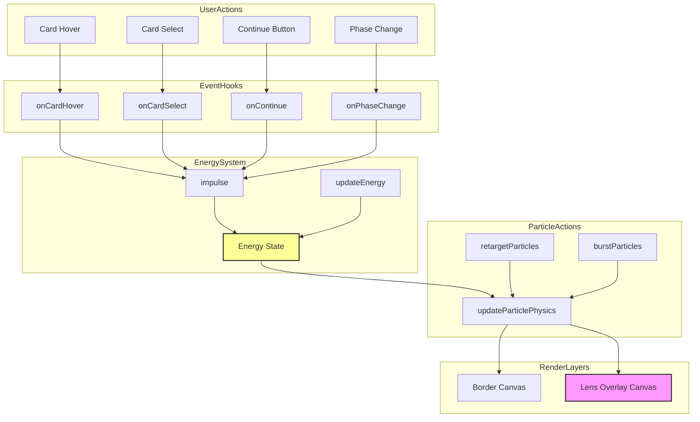

# Energy Field Enhancement Plan

## Overview

Enhance the existing diegetic lens optics particle system with an energy-based impulse system that makes particles respond dynamically to user actions (card hover, card select, continue button, phase transitions).

## Current State Analysis

The existing implementation includes:
- ✅ Sprite-based bokeh rendering with screen blend mode
- ✅ Phase-reactive forces (intro drift, preview attraction, outro scatter)
- ✅ Video brightness sampling for exposure-reactive bokeh
- ✅ Edge emanation (bokeh spawns near video edge)
- ✅ Depth-of-field rules (z-depth affects size, speed, alpha)
- ✅ 6-layer stack (ambient glows, particles, light leaks, edge bloom, video, vignette)
- ✅ Border-only particle placement

## New Requirements

### 1. Energy/Impulse System
- Single scalar `energy ∈ [0..1]` that drives particle behavior
- Idle energy ~0.08 (subtle drift, low alpha, minimal parallax)
- Actions add impulses (+0.25 to +0.8)
- Energy decays smoothly back to idle baseline
- Particles respond to energy: speed/size/opacity = base * (1 + k * energy)

### 2. Two-Layer Particle System
- **Border Layer** (outside video): Rich particle field, 30-60% more bokeh
- **Lens Layer** (over video): Only medium + large bokeh with screen blend mode, edge mask

### 3. Action Types and Impulses
| Action | Impulse | Target | Behavior |
|--------|---------|--------|----------|
| Card Hover | +0.12 | Card center | Subtle brighten, gentle pull |
| Card Select | +0.35 | Card center | Retarget ~45% of particles, size shift |
| Continue | +0.55 | Video center → edges | Pull to center then outward |
| Intro Phase | +0.7 | Center | Pull particles inward |
| Outro Phase | +0.7 | Edges | Scatter particles outward |

### 4. Particle Properties Update
Add to existing Particle interface:
```typescript
interface Particle {
    // ... existing properties
    ax: number;        // Anchor X (where particle "wants" to be)
    ay: number;        // Anchor Y
    vx: number;        // Velocity X
    vy: number;        // Velocity Y
    sizeTarget: number; // Target size for smooth transitions
    baseSize: number;  // Original size reference
}
```

### 5. Energy Modulation Formulas
```typescript
// Speed multiplier: idle 1.17x, burst up to 3.2x
speedMul = 1 + 2.2 * energy;

// Alpha multiplier: brighter during action
alphaMul = 1 + 1.5 * energy;

// Size multiplier: gentle size swell
sizeMul = 1 + 0.35 * energy;
```

## Implementation Plan

### Phase 1: Core Energy System

**File: `src/components/video-menu/particles/energySystem.ts`** (new)
- `EnergyState` interface with energy, energyVel, lastUpdate
- `initEnergyState()` - Initialize energy system
- `impulse(amount)` - Add energy impulse
- `updateEnergy(dt)` - Decay energy back to idle baseline
- `getEnergyMultipliers(energy)` - Return speed, alpha, size multipliers

### Phase 2: Particle Property Updates

**File: `src/components/video-menu/particles/ParticleTypes.ts`** (modify)
- Add `ax`, `ay`, `vx`, `vy`, `sizeTarget`, `baseSize` to Particle interface
- Initialize these properties in `createParticle()`

### Phase 3: Retarget and Burst Functions

**File: `src/components/video-menu/particles/energyActions.ts`** (new)
- `retargetParticles(particles, target, strength)` - Move subset of particles to new anchors
- `burstParticles(particles, center, strength)` - Apply outward velocity burst
- `updateParticlePhysics(p, dt, energy)` - Steering toward anchor, damping, integration

### Phase 4: Event Hooks

**File: `src/components/video-menu/particles/eventHooks.ts`** (new)
- `onCardHover(particles, cardId, videoRect, energyState)` - Hover impulse
- `onCardSelect(particles, cardId, videoRect, energyState)` - Select impulse + retarget
- `onContinue(particles, videoRect, energyState)` - Continue impulse + pull then scatter
- `onPhaseChange(particles, phase, videoRect, energyState)` - Phase transition impulse

### Phase 5: Lens Overlay Layer

**File: `src/components/video-menu/ParallaxBorder.tsx`** (modify)
- Add second canvas for lens overlay (z-index above video)
- Lens canvas: screen blend mode, edge mask, only medium+large bokeh
- Border canvas: existing implementation, richer particle density

### Phase 6: Animation Loop Updates

**File: `src/components/video-menu/particles/animationLoop.ts`** (modify)
- Integrate energy system into `animateFrame()`
- Update energy state each frame
- Apply energy multipliers to particle properties
- Use physics-based movement (anchor steering) instead of simple wandering

### Phase 7: Integration

**File: `src/components/video-menu/ParallaxBorder.tsx`** (modify)
- Expose event hook functions via ref or props
- Connect to VideoMenu component events
- Initialize energy system and lens overlay

## Architecture Diagram



## Particle Distribution by Layer

| Layer | Particle Type | Count | Size Range | Alpha Range |
|-------|--------------|-------|------------|-------------|
| Border | veggie | 18 | 14-28 | 0.15-0.45 |
| Border | bokehSmall | 45 | 3-10 | 0.05-0.18 |
| Border | bokehMedium | 27 | 12-28 | 0.04-0.12 |
| Border | bokehLarge | 12 | 30-60 | 0.02-0.06 |
| Border | firefly | 24 | 1.5-3.5 | 0-0.7 |
| **Border Total** | | **126** | | |
| Lens | bokehMedium | 10-18 | 14-34 | 0.03-0.09 |
| Lens | bokehLarge | 6-10 | 40-90 | 0.02-0.06 |
| Lens | dust (optional) | 12-20 | tiny | 0.015-0.04 |
| **Lens Total** | | **28-48** | | |
| **Grand Total** | | **154-174** | | |

## Mobile Optimization

- **Desktop**: Both border and lens layers active
- **Mobile**: Lens layer only (reduced particle count, DPR cap 1.25)

## Testing Checklist

- [ ] Energy impulses trigger correctly on user actions
- [ ] Energy decays smoothly back to idle baseline
- [ ] Particles respond to energy with speed/size/alpha modulation
- [ ] Retargeting affects ~45% of particles (not chaotic)
- [ ] Lens overlay uses screen blend mode correctly
- [ ] Edge mask prevents bokeh from obscuring video center
- [ ] Phase transitions create appropriate pull/scatter effects
- [ ] Mobile performance is acceptable (60fps)
- [ ] No TypeScript errors
- [ ] Visual result matches "diegetic lens optics" aesthetic

## Next Steps

1. Implement core energy system (`energySystem.ts`)
2. Update particle types with new physics properties
3. Create retarget and burst functions
4. Implement event hooks for all user actions
5. Add lens overlay canvas layer
6. Update animation loop with energy integration
7. Connect to VideoMenu component events
8. Test and refine
